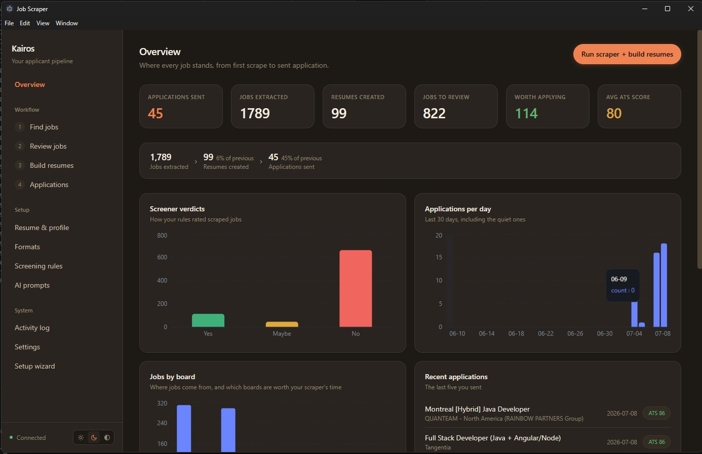
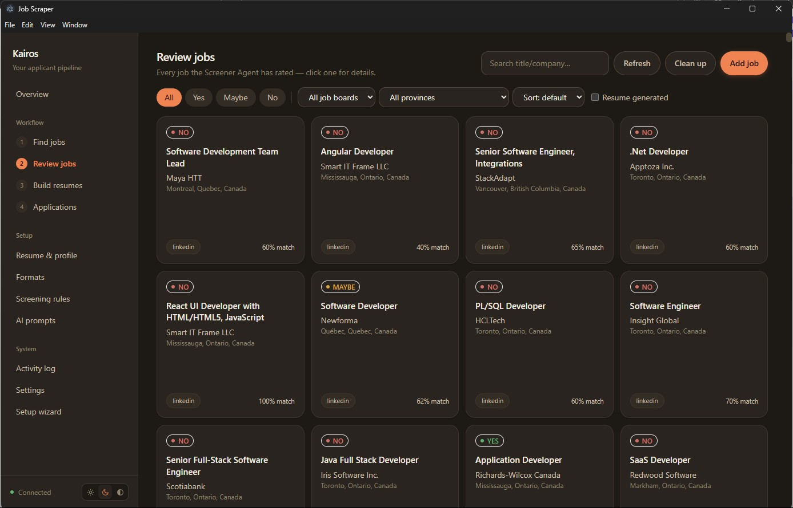

# Kairos

An AI job-hunting pipeline: scrape postings from a dozen job boards, screen
them against your profile with an LLM, and generate a tailored,
ATS-optimized resume + cover letter for every job worth applying to — all
driven by [LangGraph](https://github.com/langchain-ai/langgraph) multi-agent
graphs. Ships as a desktop app (Electron + React) with a headless CLI
underneath for scripting.





## Contents

- [How it works](#how-it-works)
- [Setup, step by step](#setup-step-by-step)
- [Requirements](#requirements)
- [Installation](#installation)
- [Configuration](#configuration)
- [Usage](#usage)
  - [Desktop app](#desktop-app)
  - [Mobile app](#mobile-app)
  - [CLI](#cli)
- [Building a Windows installer](#building-a-windows-installer)
- [Project layout](#project-layout)
- [Supported job boards](#supported-job-boards)
- [Tech stack](#tech-stack)
- [License](#license)

## How it works

Three LangGraph graphs, chained by shared SQLite state:

1. **Scrape graph** (`graph/scrape_graph.py`) — the vendored `jobspy` scraper
   pulls postings from your configured sites/search terms, then a
   **Screener Agent** rates each one (`yes` / `maybe` / `no`) against your
   profile, required skills, and experience level. Results land in `jobs.db`.
2. **Review** (`main.py review` or the desktop Applied/Dashboard views) —
   browse `yes`/`maybe` jobs and override a verdict you disagree with.
3. **Apply graph** (`graph/apply_graph.py`) — for every unbuilt `yes` job:
   Skills/Experience/Project/Custom-Section writer agents draft a resume in
   LaTeX, an **ATS Checker** scores it against the job description, and an
   **Optimizer** agent rewrites weak sections in a loop (up to
   `max_ats_iterations`) until it passes `ats_pass_threshold` or stops
   improving. The final LaTeX is compiled to PDF and the job is marked
   applied in `applied.db`.

All LLM calls go through [Ollama's cloud API](https://ollama.com) via a
rotating multi-key client (`llm/client.py`), so a rate-limited key
automatically falls over to the next one.

## Setup, step by step

Follow these in order. **Part A** gets the desktop app running. **Part B** is
optional and adds the phone app. Every command is copy-pasteable; Windows is
assumed (swap the venv-activate line on macOS/Linux).

### Part A — Desktop app

**1. Get the code and a Python environment**

```bash
git clone <this-repo-url>
cd Kairos

python -m venv venv
venv\Scripts\activate            # Windows
# source venv/bin/activate       # macOS/Linux

pip install -r requirements.txt
playwright install chromium
```

**2. Install a LaTeX engine** (renders resumes to PDF — Tectonic is easiest):

```bash
winget install --id TectonicTypesetting.Tectonic   # Windows
# brew install tectonic                             # macOS
```

**3. Get an Ollama Cloud API key** (this is the LLM the agents use):

- Sign up at [ollama.com](https://ollama.com) → **Settings → API keys** →
  **Create key**. Copy it.

**4. Create your `.env`** in the project root (copy the template, then paste
your key):

```bash
cp .env.example .env
```

Open `.env` and set your key. You can add more than one — they rotate when a
key hits its rate limit:

```
OLLAMA_API_KEY_1=paste-your-ollama-key-here
```

(Leave `TUNNEL_TOKEN` blank for now — it's only for the mobile app, Part B.)

**5. Install the desktop app and run it:**

```bash
cd desktop
npm install
npm start
```

Electron opens, spawns the backend on `127.0.0.1:8756`, and walks you through
onboarding (name, profile, screener rules) on the **Setup** page. You can also
paste the Ollama key on the **Settings** page instead of editing `.env`. That's
the desktop app fully working.

### Part B — Mobile app (optional)

Run Kairos on your phone from any network. Do Part A first.

**6. Install the mobile app's dependencies:**

```bash
cd ../mobile
npm install
```

**7. Get `cloudflared`** (the tunnel tool the desktop app drives — no account
needed) and place it where the app looks:

```bash
winget install --id Cloudflare.cloudflared
```

Then copy the installed `cloudflared.exe` to
`desktop/build-resources/cloudflared/cloudflared.exe` (or just make sure
`cloudflared` is on your `PATH`).

**8. Generate a tunnel token** (a shared secret so only your phone can reach
the tunneled backend):

```bash
python -c "import secrets; print(secrets.token_urlsafe(32))"
```

Copy the printed value into **both** places, exactly the same:

- `.env` → `TUNNEL_TOKEN=<the-value>`
- `mobile/config.ts` → `export const API_TOKEN = "<the-value>";`

The two **must** match — the backend rejects tunnel traffic whose `x-api-token`
doesn't equal `TUNNEL_TOKEN`. `mobile/config.ts` ships with a placeholder
token, but `.env` is gitignored (a fresh clone has none), so you do need to set
`TUNNEL_TOKEN` here.

**9. Install [Expo Go](https://expo.dev/go)** on your phone (App Store / Play
Store).

**10. Start it and scan:**

- In the running desktop app, open the **Mobile** tab → click **Start mobile**.
- Wait for the QR code (first run ~20–30s while it bundles).
- Open **Expo Go** on your phone and scan the QR.

The app loads over the internet — no same-WiFi needed. Click **Stop** (or quit
the desktop app) to tear the tunnels down. You never touch the tunnel URL by
hand; the desktop app rewrites `API_BASE` in `mobile/config.ts` on every start.

## Requirements

- **Python 3.11+**
- **Node.js 18+** and npm (desktop app only)
- An [Ollama](https://ollama.com) account + API key (cloud inference, not a
  local model server)
- A LaTeX engine to render resumes to PDF — either:
  - [Tectonic](https://tectonic-typesetting.github.io/) (no local TeX
    install needed, resolves packages on the fly), or
  - `pdflatex` from a MiKTeX/TeX Live install
- [Playwright](https://playwright.dev/) Chromium (needed for
  cookie-gated sites like Glassdoor/Google jobs)

Mobile app only (optional — use Kairos from your phone):

- [`cloudflared`](https://developers.cloudflare.com/cloudflare-one/connections/connect-networks/downloads/)
  — the desktop app tunnels the backend and Expo dev server through it (no
  account needed for quick tunnels)
- [Expo Go](https://expo.dev/go) installed on your phone (iOS or Android)

## Installation

```bash
git clone <this-repo-url>
cd Kairos

python -m venv venv
venv\Scripts\activate          # Windows
# source venv/bin/activate     # macOS/Linux

pip install -r requirements.txt
playwright install chromium
```

Install a LaTeX engine (either works, Tectonic is the path of least
resistance):

```bash
# Tectonic (recommended)
winget install --id TectonicTypesetting.Tectonic   # Windows
# brew install tectonic                             # macOS

# or a full TeX Live/MiKTeX install for pdflatex
```

For the desktop app:

```bash
cd desktop
npm install
```

For the mobile app (optional):

```bash
cd mobile
npm install
```

Then put a `cloudflared` binary where the desktop app looks for it — either on
your `PATH`, or at `desktop/build-resources/cloudflared/cloudflared.exe`
(that's also where the Windows installer bundles it from):

```bash
# Windows
winget install --id Cloudflare.cloudflared
# then copy the installed cloudflared.exe into desktop/build-resources/cloudflared/
```

## Configuration

Nothing to hand-edit before first run — `config.py` auto-copies
[`config.example.json`](config.example.json) to `config.json` (gitignored,
holds your personal profile/prompts) the first time anything imports it.
From there, configure through the desktop app's **Setup** and **Settings**
pages, or edit `config.json` directly:

| Section | Purpose |
|---|---|
| `scraper` | sites to search, location, search terms, results wanted |
| `profile` | your name, contact info, experience, `not_fit_for` roles |
| `screener` | pass/fail thresholds, required/preferred skills, blacklisted companies |
| `pipeline` | ATS iteration limits, output filenames, LaTeX template |
| `prompts` | every LLM prompt (screener, section writers, ATS checker) — user-editable |
| `custom_sections` | resume sections beyond the built-in skills/experience/projects |

Two more inputs live next to `config.json`:

- **`resume.txt`** / **`projects.txt`** — your source resume and project
  list the writer agents draw from.
- **`.env`** — holds `OLLAMA_API_KEY_1`, `OLLAMA_API_KEY_2`, ... (multiple
  keys enable rotation on rate limits). Set via the Settings page, or by
  hand:

  ```
  OLLAMA_API_KEY_1=your-key-here
  ```

## Usage

### Desktop app

```bash
cd desktop
npm start
```

This runs Vite (dev server) and Electron together, with Electron spawning
the FastAPI backend (`server.py`) as a subprocess on `127.0.0.1:8756`. The
app walks you through onboarding (Setup page) on first launch.

### Mobile app

Run Kairos on your phone from **any network** — no same-WiFi requirement. The
desktop app does all the plumbing behind one button.

**One-time setup**

1. `cd mobile && npm install` (see [Installation](#installation)).
2. Put `cloudflared` on your `PATH` or at
   `desktop/build-resources/cloudflared/cloudflared.exe`.
3. Install **Expo Go** on your phone.
4. Set a shared secret so only your phone can reach the tunneled backend: put
   the same value in **`.env`** (`TUNNEL_TOKEN=...`) and in
   **`mobile/config.ts`** (`API_TOKEN`). The repo ships with a matching pair
   already — change both if you want your own.

**Each session**

1. Start the desktop app (`cd desktop && npm start`).
2. Open the **Mobile** tab in the sidebar and click **Start mobile**.
3. Wait for the QR (first run takes ~20–30s while Metro bundles), then scan it
   with **Expo Go**.

Under the hood, **Start mobile** opens two Cloudflare tunnels — one to the
backend API (written into `mobile/config.ts` as `API_BASE`) and one to the
Expo/Metro dev server (passed to Expo via `EXPO_PACKAGER_PROXY_URL`) — then
launches Expo. The QR encodes the Metro tunnel as an `exp://` URL. Clicking
**Stop** (or quitting the app) tears all of it down. You never edit the tunnel
URL by hand; it's rewritten on every start.

> Expo's own `--tunnel` (ngrok) is intentionally not used — it's flaky and
> increasingly needs an account. Reusing `cloudflared` for both tunnels keeps
> the flow account-free.

### CLI

The headless path — same agents/graphs, no Electron:

```bash
python main.py scrape   # scrape + AI-screen new jobs into jobs.db
python main.py review   # browse yes/maybe jobs, flip a verdict if you disagree
python main.py apply    # build + apply for every unbuilt "yes" job
```

Or run just the API backend (e.g. to point a different frontend at it):

```bash
uvicorn server:app --port 8756
```

## Building a Windows installer

```bash
cd desktop
npm run dist:win
```

This bundles the React app, freezes `server.py` into `server.exe` via
PyInstaller (`server.spec`), and packages both — plus Tectonic, a portable
Chromium, and resume icons — into an NSIS installer with `electron-builder`.
A packaged build stores user data (config/resume/dbs) in the OS per-user
app-data directory instead of next to the executable.

## Project layout

```
agents/       LangGraph agent nodes — screener, resume section writers, ATS checker/optimizer
graph/        Graph wiring (scrape_graph, apply_graph) + state schema
jobspy/       Vendored multi-site job scraper (this repo's own fork)
llm/          Rotating Ollama Cloud client shared by every agent
db/           SQLite-backed JobsDB / AppliedDB managers
tools/        LaTeX compilation + resume template management
desktop/      Electron + React + Tailwind frontend (Electron main.cjs runs the mobile bridge)
mobile/       Expo / React Native app, loaded onto the phone via Expo Go
server.py     FastAPI backend the desktop app talks to
main.py       Headless CLI entry point (scrape / review / apply)
config.py     Loads config.json + .env; config.example.json is the template
```

## Supported job boards

Indeed, LinkedIn, Glassdoor, ZipRecruiter, Google Jobs, JobRight, Wellfound,
Naukri, Bayt, BDJobs.

## Tech stack

**Backend:** Python, LangGraph, FastAPI, SQLite, Ollama Cloud, Playwright
**Frontend:** React, TypeScript, Vite, Tailwind CSS, Electron
**Mobile:** React Native, Expo (Expo Go), Cloudflare Tunnel
**Resume rendering:** LaTeX (Tectonic / pdflatex)

## License

MIT — see [LICENSE](LICENSE).
